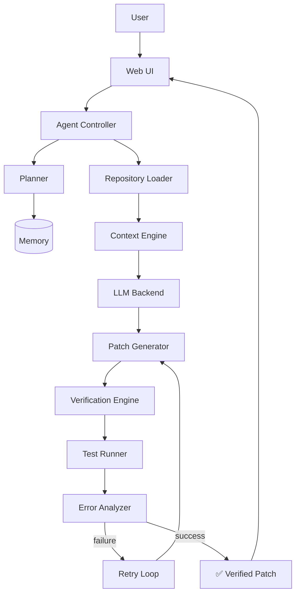

# CodeRush 2.0 | Team Project Repository
## Project Information

+ Team Name: Rush Bots

+ Project Title: TermHarness AI

+ Track/Theme: Developer Tools / AI & Agentic Systems


## 📋 Table of Contents
1. Real-World Motivation
2. Executive Summary
3. Vision
5. Architecture
6. Tech Stack
7. Folder Structure
8. Installation
9. Benchmark
10. Why It's Different
11. Security
12. Future Roadmap
13. Contributing
14. Acknowledgements

## Project Description
Problem: Standard Large Language Models (LLMs) struggle to independently fix complex software bugs because they lack environmental context, historical memory, and the ability to verify their own outputs.

---

## 🌍 Real-World Motivation

Engineering teams lose meaningful time to problems that autonomous verification directly addresses:

| Pain Point | Impact |
|---|---|
| **Large, unfamiliar repositories** | Engineers (and LLMs) waste time re-deriving context that already exists in the codebase |
| **Legacy code with poor coverage** | Bugs are easy to introduce and hard to catch without running the actual suite |
| **Regression bugs** | A "fix" that breaks something else is often worse than no fix at all |
| **CI failures found late** | Feedback arrives after a PR is opened, not while the fix is being written |
| **Hallucinated patches** | LLMs can confidently reference functions, files, or APIs that don't exist |
| **Manual debugging cycles** | Developers repeatedly copy-paste stack traces back into a chat window |
| **Code review bottlenecks** | Reviewers become the verification layer AI tooling should have already run |

None of these are hypothetical — they are the daily friction of working with AI-assisted code today. TermHarness AI's core bet is that **an agent that verifies its own work before handing it to a human is worth more than an agent that writes slightly better first drafts.**

---

# 🧭 Executive Summary
   *   TeamHarness AI is a model-independent, web-based agentic coding harness designed to securely intake a target repository, analyze issue descriptions, and generate code patches. Unlike raw LLMs, Rush-Code utilizes a verification-first loop: it runs local test suites (e.g., pytest) against its generated code, reads the error outputs, and iteratively revises the code until the tests pass. The platform includes a dedicated UI to view the agent's execution trace and a side-by-side ablation study comparing raw LLM outputs to our verified harness.

  *    Modern AI coding assistants — ChatGPT, Claude, Gemini, GitHub Copilot, Cursor — are remarkably good at producing code. They are far less reliable at proving that code works.

  *    In professional software engineering, "the code compiles" and "the code is correct" are two different claims. Every serious codebase enforces this distinction through unit tests, integration tests, static analysis, and human code review. A raw LLM completion skips all of that: it emits a plausible-looking patch and stops. Whether that patch actually resolves the bug, breaks an unrelated test, or subtly changes behavior is left entirely to the human reviewer to discover — often after the fact.

  *    TermHarness AI (Rush-Code) closes this gap. It is a model-independent harness that wraps any LLM in a verification loop borrowed from real engineering practice: generate a patch, run the actual test suite against it, read the failure output, reason about why it failed, and revise — repeating until the tests pass or a retry budget is exhausted. The result is not a chat transcript; it's a patch with evidence behind it.

 ---

# 🔭 Vision

  TermHarness AI is designed to behave less like a chatbot and more like a junior engineer who:

  * Reads the issue before touching code
  * Explores the repository instead of guessing at file contents
  * Writes a patch, then runs it instead of assuming it's correct
  * Reads the actual error output when something fails
  * Revises deliberately, informed by that output — not by re-rolling the same prompt
  * Shows its work, so a human reviewer can audit how it arrived at the final patch

The long-term goal is a harness that is model-independent (swap in any LLM backend), verification-first (no patch ships without a test run behind it), and transparent (every step of the reasoning-execution loop is visible in the UI).

---

🏗️ Architecture




Diagram reflects the target architecture. See Key Features for what is implemented today versus planned.

---

## 🧰 Tech Stack

| Layer | Technology |
|---|---|
| **Frontend** | React, TypeScript, Vite `<!-- update to match your actual stack -->` |
| **Backend** | Python (FastAPI) `<!-- update -->` |
| **AI / Orchestration** | Model-agnostic LLM client layer (Anthropic / OpenAI-compatible) |
| **Databases** | SQLite (local dev) / PostgreSQL (planned) |
| **Testing** | Pytest (target repos), Jest/Vitest (harness itself) |
| **Containers** | Docker (planned for sandboxed execution) |
| **Deployment** | TBD — Vercel / Render / self-hosted |
| **CI/CD** | GitHub Actions (planned) |
| **Version Control** | Git / GitHub |
| **Observability** | Structured execution logs surfaced via the Execution Timeline UI |

*Replace placeholders with your team's actual choices before submission — an accurate stack table is more credible to judges than a generic one.*

---

## 📁 Folder Structure
```

CodeRush2.0_Rush-Bots-main/
├── .gitignore
├── README.md
├── error_check.py          # 7.5 KB, unclear purpose, sits at root
├── main.py                 # entry point (5 lines)
├── requirements.txt
├── screens/                # Textual screen views
│   ├── benchmark.py
│   ├── context.py
│   ├── dashboard.py
│   ├── evidence.py
│   ├── execution.py
│   ├── memory.py
│   ├── repository.py     
│   ├── settings.py
│   ├── task.py
│   └── verification.py
├── services/                # core logic
│   ├── benchmark.py      
│   ├── llm_adapter.py       # real one — talks to local Ollama
│   ├── parser.py
│   ├── patcher.py
│   ├── scanner.py
│   ├── tempCodeRunnerFile.py  
│   ├── temp_llm              
│   └── verifier.py
├── tui/
│   ├── __init__.py
│   └── tui.py               # App class, wires up Dashboard
└── widgets/
    ├── context_menu.py
    ├── footerbar.py
    ├── homepage.py
    ├── logpanel.py          
    ├── sidebar.py
    ├── statusbar.py         
    └── topbar.py

```

*Adjust to your actual repo layout — this is a representative structure for a project of this shape.*

---

## ⚙️ Installation

### Prerequisites
- Python 3.10+
- [Ollama](https://ollama.com) installed locally (the app runs its LLM calls against a local Ollama server — no API key required)

### Steps

```bash
# 1. Clone the repository
git clone https://github.com/limaytidke/CodeRush2.0_Rush-Bots.git
cd CodeRush2.0_Rush-Bots

# 2. Create and activate a virtual environment
python -m venv .venv
source .venv/bin/activate      # Windows: .venv\Scripts\activate

# 3. Install dependencies
pip install -r requirements.txt

# 4. Pull the model the app expects
ollama pull qwen2.5-coder:3b

# 5. Start Ollama (if not already running as a background service)
ollama serve

# 6. Run the app (in a separate terminal, from the repo root)
python main.py
```

The app launches directly as a terminal UI — no browser or separate server needed.

> **Note:** `services/verifier.py` shells out to `pytest` to run a target repository's test suite, so `pytest` must be installed (it's included in `requirements.txt`).

---
## 📊 Benchmark (Illustrative)

> [!WARNING]
> The numbers below are **illustrative placeholders**, not measured results. Replace them with your actual evaluation data before publishing — do not present example figures as real findings.

| Metric | Raw LLM (single-shot) | TermHarness AI |
|---|---|---|
| Test Pass Rate | *e.g., X%* | *e.g., X%* |
| Avg. Iterations to Pass | 1 (no retry) | *e.g., N* |
| Patches Verified Before Delivery | No | Yes |
| Regressions Introduced (sampled) | *unmeasured* | *unmeasured* |
| Reviewer Trust (qualitative) | Low–Medium | *to be evaluated* |

**Methodology (to fill in):** dataset used (e.g., a SWE-bench-style subset or your own curated issue set), number of repositories/issues tested, retry budget, and how "success" was defined.

---

## 🆚 Why It's Different

| | Focus | Verification Loop | Model Lock-in |
|---|---|---|---|
| **GitHub Copilot** | Inline code completion | No | Yes (proprietary) |
| **Cursor** | AI-native IDE editing | Partial (human-in-the-loop) | No (multi-model) |
| **Claude Code / ChatGPT / Gemini CLI** | Conversational code generation | No automatic test-and-retry loop | Provider-specific |
| **TermHarness AI** | Autonomous patch generation *and* verification | **Yes — built-in generate → test → analyze → retry loop** | No (model-independent by design) |

The differentiator isn't code quality on the first attempt — it's that **TermHarness AI treats "tests pass" as a hard requirement before a patch is presented as done**, and shows the reasoning trail that got there.

---

## 🔐 Security

- **Sandboxed execution** *(planned)*: generated code and test suites run in an isolated environment (e.g., containerized) rather than directly on the host.
- **Filesystem isolation** *(planned)*: the agent operates on a scoped copy of the target repository, not arbitrary host paths.
- **Secret protection**: API keys and credentials are read from environment variables and are never included in prompts sent to the LLM or written into execution logs.
- **Resource limits** *(planned)*: CPU/memory/time caps on test execution to prevent runaway or malicious code from affecting the host.

---

## 🗺️ Future Roadmap

- [ ] Dockerized sandbox execution
- [ ] Kubernetes-based scaling for concurrent agent runs
- [ ] Distributed multi-agent collaboration (planner/executor/reviewer roles)
- [ ] Long-term memory across sessions and repositories
- [ ] CI/CD integration via GitHub Actions
- [ ] Automatic pull request creation from verified patches
- [ ] Cloud-hosted execution environments
- [ ] IDE plugins (VS Code, JetBrains)
- [ ] Expanded multi-LLM backend support

---

## 🤝 Contributing

Contributions are welcome.

1. Fork the repository
2. Create a feature branch: `git checkout -b feature/your-feature`
3. Commit your changes with clear messages
4. Ensure tests pass locally (`pytest` / `npm test`)
5. Open a pull request describing the change and motivation

Please open an issue first for significant changes so they can be discussed before implementation.

---

## 🙏 Acknowledgements

This project draws inspiration from work and research in the autonomous software engineering agent space, including **SWE-bench**, **OpenHands**, **LangGraph**, and **AutoGen**, and builds on LLM infrastructure provided by **OpenAI** and **Anthropic**. Mention of these projects and organizations does not imply endorsement of TermHarness AI.

---
